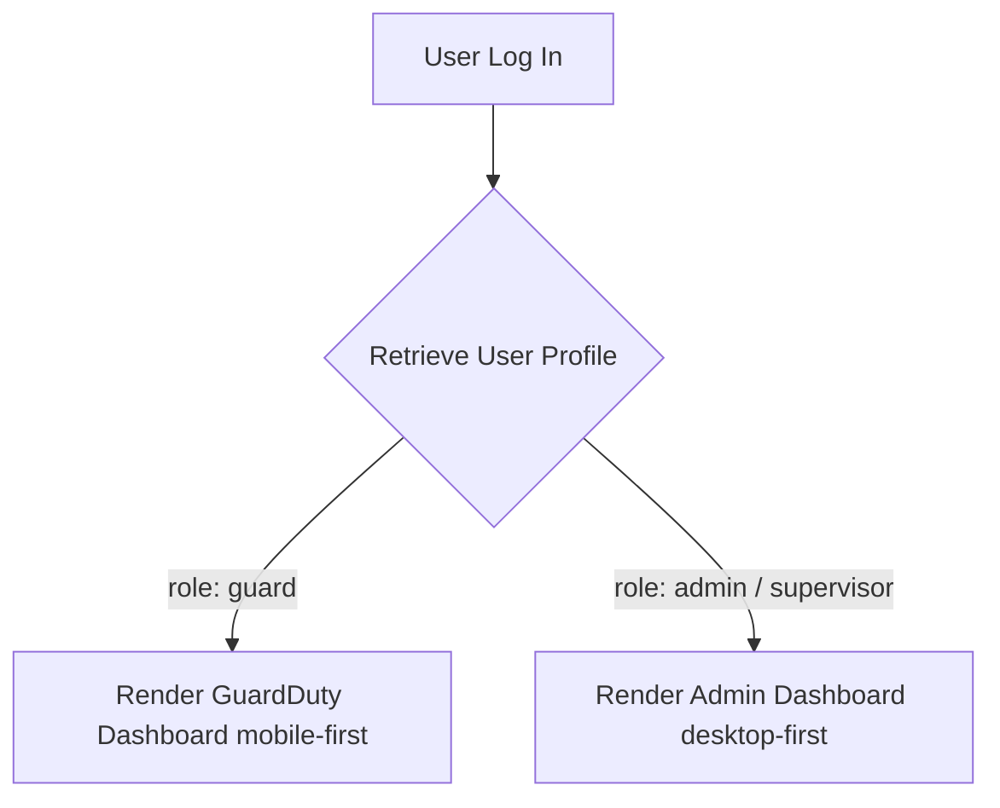

# 🛡️ SecureSys (Safety Guard Management System)

SecureSys is a modern, responsive, and secure web application designed to manage security guards, monitor attendance with GPS verification, report incidents with rich media (photos & voice notes), and track guard compliance documents.

---

## 🚀 Technology Stack

### Frontend Core
* **React.js**: Reactive user interface logic and component structure.
* **Vite**: Ultra-fast next-generation frontend tooling and hot-reloading dev server.
* **Tailwind CSS & Custom CSS**: Sleek, modern styling utilizing a premium glassmorphic UI, responsive grids, HSL palettes, and customized interactive micro-animations (`animate-slide-up`, etc.).
* **React Icons**: Standardized icons library (`react-icons/fa`).

### Backend & Database (Supabase)
* **Supabase Auth**: Manages secure user session persistence, password resets, and user email verification.
* **Supabase Postgres Database**: Stores structured data with relational schemas, indexed fields, and Row-Level Security (RLS) policies.
* **Supabase Storage**: Object storage buckets managed via Storage APIs:
  * `guard-documents`: Verification files (Aadhaar, Security Licences, etc.) and profile pictures.
  * `guard-photos`: Image attachments for incident reporting.
  * `voice-requests`: WebM voice note attachments for incidents and attendance correction requests.

---

## 🌟 Key Features

### 👥 Guard Profiles & Compliance Tracker
* **Guard Self-Service Panel**:
  * Upload a custom Profile Picture.
  * Upload required verification files: **Aadhaar Card**, **Security Licence**, **Driving Licence**, and **Other Certificates**.
* **Admin Verification Dashboard**:
  * Visual analytics cards displaying **Total Guards**, **Fully Verified** (having uploaded Aadhaar and Security Licence), and **Pending Documents**.
  * Complete registry grid showing checkmark indicators (`✅`) for uploaded files.
  * **Inline Document Previewer**: Click-to-view modal supporting image formats, PDF documents (rendered inside an interactive `<iframe>`), and fallback downloads for unsupported extensions without forcing redirection to new browser tabs.

### 📍 Attendance Control & GPS Verification
* **Location-Based Check-in/out**:
  * Calculates physical distance from the guard's current browser location to their assigned primary duty site.
  * Rejects check-in attempts if the guard is outside the site's geo-radius bounds.
* **Temporary Assignments Override**:
  * Admins can schedule temporary duty location overrides with a date range (`From` and `To`).
  * System automatically uses the temporary location coordinates for GPS verification during that range, reverting to the primary location coordinates once the end date passes.
  * Automatically publishes announcement circulars to notify staff when a guard is assigned temporarily.

### 📥 Attendance Correction Requests
* **Guard Feature**: Submit requests to correct attendance gaps by typing descriptions or recording **audio voice notes** directly inside the mobile panel.
* **Admin Review Queue**: List of all correction requests with **inline audio players** to review audio messages.
* **Clear History Action**: A trash button for admins to wipe closed requests (`Approved` or `Rejected`) while leaving active pending requests untouched. Equipped with a user-friendly custom glassmorphic confirmation modal.

### 🚨 Incident Reporting
* **Guard Incident Logging**: Report workplace issues with incident type, description, camera snapshot uploads, and voice notes.
* **Toggle History View**: Guards can easily switch between their reporting form and past complaints history using the `🕒 History` toggle button.
* **Admin Incident Monitor**: Central feed showing reported incidents, photos, audio attachments, and incident status dropdowns (`Open` / `Investigating` / `Closed`).

---

## ⚙️ How It Works (Application Flow)

### 1. Authentication & Role Routing
When a user logs in via the login page, the application queries their profile row from the database:


### 2. File Uploads & Database Linkage
File uploads are securely pushed using Supabase storage Client APIs. Upon successful upload, the file's public URL is retrieved and stored as a reference string in the Postgres table:
1. File input gets triggered -> File is sent to `supabase.storage.from("bucket").upload(...)`.
2. Supabase stores the file and returns the path.
3. App retrieves the public URL using `supabase.storage.from("bucket").getPublicUrl(...)`.
4. App updates/inserts the URL string into the respective database column (e.g., `doc_security_licence` inside `guards` or `image_url` inside `incidents`).

### 3. Geolocation Validation
Using the Haversine formula, the app determines the spherical distance between the guard's device coordinates ($lat_1, lon_1$) and their duty location coordinates ($lat_2, lon_2$):
$$d = 2R \arcsin\left(\sqrt{\sin^2\left(\frac{\Delta lat}{2}\right) + \cos(lat_1) \cos(lat_2) \sin^2\left(\frac{\Delta lon}{2}\right)}\right)$$
* If $d \le$ Allowed Threshold (e.g., 200 meters), check-in/out succeeds.
* If $d >$ Allowed Threshold, check-in is blocked, and the guard is prompted to send a correction request.

---

## 🛠️ Installation & Local Setup

### 1. Clone & Install Dependencies
Ensure you have Node.js installed on your system. Run:
```bash
npm install
```

### 2. Configure Environment Variables
Create a `.env` file in the root directory (or `.env.local`):
```env
VITE_SUPABASE_URL=your_supabase_project_url
VITE_SUPABASE_ANON_KEY=your_supabase_anon_public_key
```

### 3. Run Development Server
Start Vite's fast dev server locally:
```bash
npm run dev
```

### 4. Build Production Bundle
Build and minify for deployment:
```bash
npm run build
```
